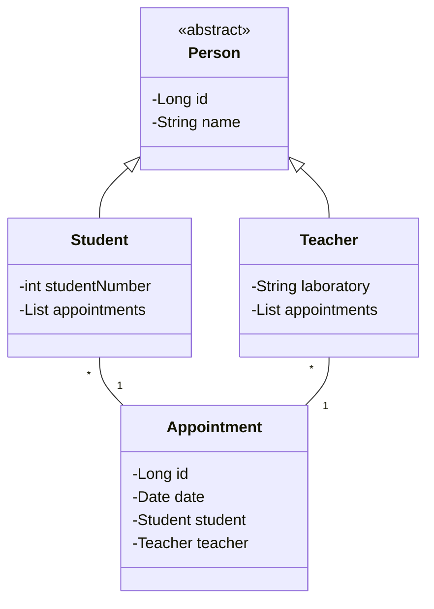

# JPA_tp
### Florian Alphonzair - ILA

Ce repository contient une implémentation du projet de TAA avec JPA, contenant un domaine basique et des DAO.
Cette petite API contient une documentation générée grâce à OpenAPI et Swagger.

La partie SpringBoot, KeyCloak et autre se situe sur cet autre repository : https://github.com/descente-ascii/spring_boot_tp

## Architecture du domaine

## Installation et lancement
Le SDK utilisé est openjdk-19 (java version 19.0.2).
Je n'ai pas créé de JAR pour ce projet, pour le lancer il suffit de lancer le main de **src.main.java.RestServer**.
Le back est relié au serveur HSQL contenu à la racine du projet (mvnw pour Linux et run-hsqldb-server.bat pour Windows)

Le serveur écoute sur le **port 8080**. Le user est "sa" sans guillemets et il n'y a pas de mot de passe.

## Requêtes HTTP (Insomnia)
Pour faciliter vos tests, vous pouvez importer dans Insomnia le fichier Insomnia_jpa_test_requests.json
situé à la racine du projet. Il contient un ensemble de requêtes HTTP couvrant l'ensemble des fonctionnalités de cette API.
Pour le moment, il réside encore quelques erreurs dans l'API : les endpoints de Appointment retournent tous 404 not found,
lorsque l'on tente de delete une Person qui est présente dans Appointment une erreur surgit (foreign key no action)...
